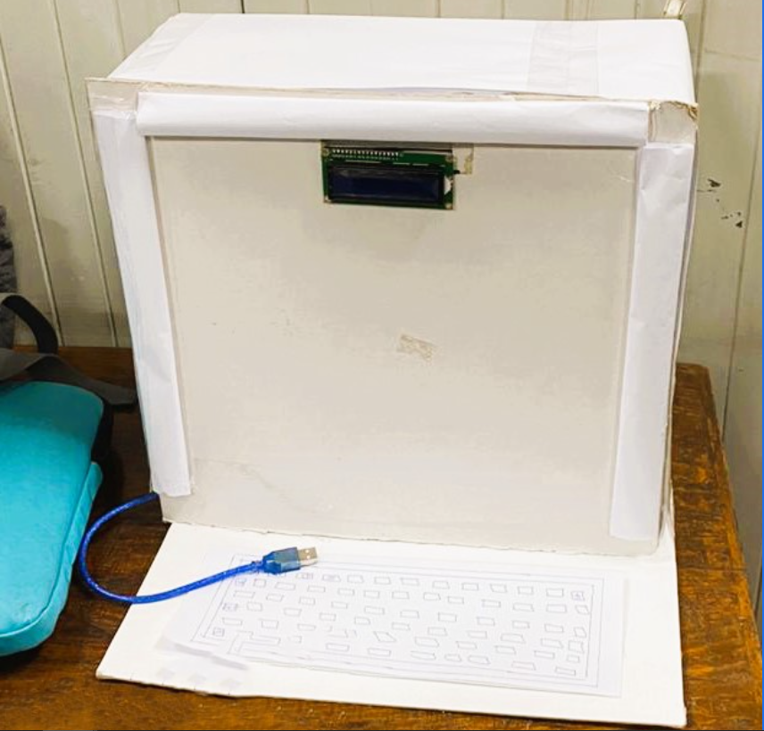
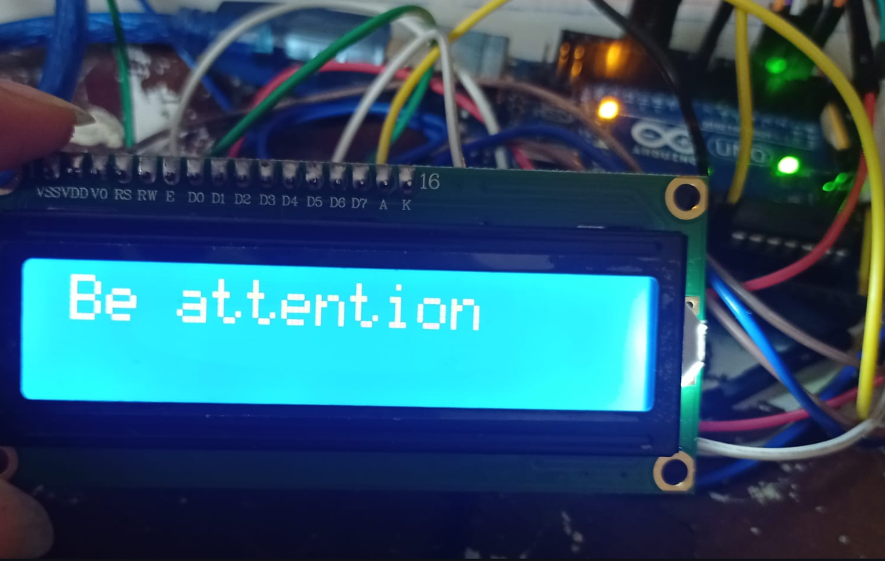

# EEG-Based Laptop Screen with Eye Detection

## Introduction
This project aims to develop a laptop screen with an integrated LCD and alarm system that monitors the user's eye movements using EEG brain signals. When the system detects that the user's eyes are closed for 10 seconds, it triggers an alarm to alert the user and prompt them to open their eyes.

## Features
### Part 1: EEG Data Processing
- **EEG Data Acquisition:** Search for raw EEG brain signals suitable for the project.
- **Signal Preprocessing:** Process raw EEG data to remove noise, filter unwanted frequencies, and enhance signal quality. Techniques include artifact removal, bandpass filtering, and baseline correction.
- **Feature Extraction:** Extract relevant features from preprocessed EEG signals, such as power spectral densities, band power ratios, or statistical measures like mean and variance.
- **Signal Visualization:** Develop a simple GUI to compare filtered and unfiltered EEG signals.

### Part 2: Model Development
- **Model Training:** Train a machine learning model (e.g., Support Vector Machine, Random Forest, Neural Network) using extracted features and labeled data. The model associates specific brain patterns with intended mental tasks.
- **Real-time Classification:** Implement the trained model to classify ongoing EEG signals. Continuously process incoming data and predict the user's current mental state or intention.
- **Actuator Control:** Translate model output into appropriate actions using an actuator control mechanism.

## Code Structure
- **EEG_Processing:** Contains scripts for EEG data preprocessing, feature extraction, and signal visualization.
- **Model_Development:** Includes scripts for training machine learning models and real-time classification.
- **Actuator_Control:** Implements actuator control mechanisms based on model predictions.
- **Utilities:** Helper functions and utilities used across different components.

## Setup and Usage
1. **EEG Data Acquisition:** Obtain suitable raw EEG data for the project.
2. **Signal Preprocessing:** Run preprocessing scripts to clean and enhance EEG signals.
3. **Feature Extraction:** Extract relevant features from preprocessed signals using provided scripts.
4. **Model Training:** Train machine learning models using extracted features and labeled data.
5. **Real-time Classification:** Deploy trained models to classify ongoing EEG signals in real-time.
6. **Actuator Control:** Implement actuator control mechanisms to translate model predictions into actions.

## Dependencies
- Python 3.x
- NumPy, SciPy, Pandas
- Scikit-learn, TensorFlow, PyTorch (for model development)
- Matplotlib, PyQt5 (for visualization)
- Additional dependencies may be required for specific tasks.

